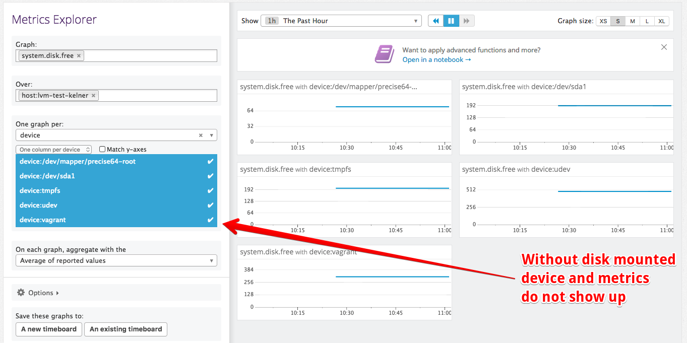
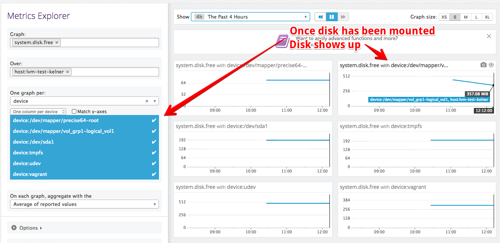

# datadog-lvm-vagrant
Testing Unmounted Volume Reporting in Datadog.
This will create an Ubuntu vagrant with an unmounted volume.
This volume metrics will not be collected until the volume is mounted.
This can be tested by running the vagrant box, observing the disk metrics in
Datadog by device, then mounting the volume afterwards, then re-observing those
same metrics. See instructions and screenshots below for examples.

## Running
- Execute `DD_API_KEY=$DD_API_KEY vagrant up` from the command line, where
  `$DD_API_KEY` is either an environment variable or your actual API key.
- You can ssh into the box via `vagrant ssh`
- You can verify the Datadog agent is running and reporting via:
  `sudo /etc/init.d/datadog-agent info`
- You can view the unmounted volume via:
  - `sudo pvscan`
  - `sudo vgdisplay`
  - `sudo vgscan`
  - `sudo lsblk -o NAME,FSTYPE,SIZE,MOUNTPOINT,LABEL`
- Observe in Datadog that the disk is not present
  - 
- Mount the disk:
  - `vagrant ssh`
  - `sudo mkdir /mnt/vagrant_disk`
  - `sudo mount /dev/vol_grp1/logical_vol1  /mnt/vagrant_disk`
  - `sudo lsblk -o NAME,FSTYPE,SIZE,MOUNTPOINT,LABEL`
- Observe in Datadog that the disk is present
  - 
